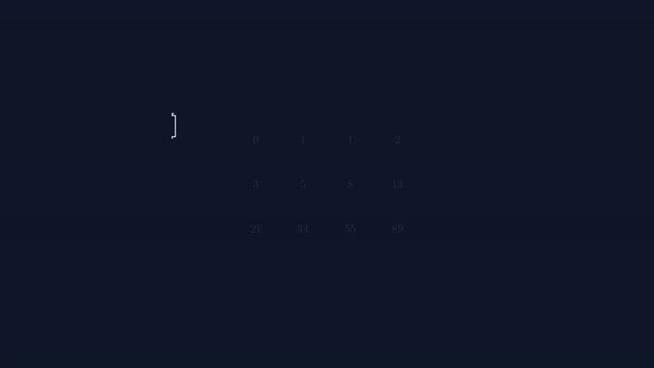

# Binet's Formula Manim Presentation

This project contains a Manim-based mathematical presentation explaining Binet's Formula for Fibonacci numbers. The presentation derives the closed-form expression for Fibonacci numbers using linear algebra and eigenvalue decomposition.

## Overview

Binet's Formula provides a direct way to compute the nth Fibonacci number without recursion or iteration:
```
F(n) = (φ^n - ψ^n) / √5
```
where φ = (1+√5)/2 (the golden ratio) and ψ = (1-√5)/2.

The presentation walks through:
1. The Fibonacci recurrence relation and its matrix representation
2. Eigenvalue decomposition of the Fibonacci matrix
3. Derivation of Binet's Formula from the diagonalization
4. Verification and examples of the formula in action

## Files in this Repository

- `binet_v2.py` - The main Manim presentation script (Improved Edition with 48 slides)
- `binet_formula_presentation.py` - Alternative/older version of the presentation
- `BinetPresentation_v7_1080p.html` - The latest interactive HTML export of the presentation
- `BinetPresentation.json` / `_v2.json` - Slide configurations for `manim-slides`
- `BinetPresentation_*.mp4` - Various rendered video versions (480p drafts and 1080p finals)
- `media/videos/binet_formula_presentation/` - Directory containing rendered video output
- `worklog_v4.md` - Development log documenting fixes and improvements
- `LA_PROJECT_REPORT_ALMOST_FINAL_DRAFT.pdf` - Related linear algebra report

## Key Features

- **Systematic Layout Approach**: Uses VGroup().arrange() for consistent spacing and center_content() helper to prevent overlapping elements
- **High-Quality Rendering**: Rendered at 1080p60 quality for clear mathematical notation
- **Pattern Demonstration**: Includes dedicated slides showing Fibonacci patterns before derivation
- **Package Compatibility**: Avoids LaTeX packages that may not be available by default
- **Verified Output**: All overlapping issues eliminated through systematic layout approach

## Video Output

The final presentation video is previewed below (auto-playing). Click the preview or the link below to watch the full high-quality 1080p version.

[](https://github.com/YTxFSGAMERz/Binet-Presentation/releases/download/v1.0.0-video/BinetPresentation.mp4)

**Watch / Download:**
- 📺 **[Watch Full 1080p60 Video (Direct Link)](https://github.com/YTxFSGAMERz/Binet-Presentation/releases/download/v1.0.0-video/BinetPresentation.mp4)**
- 📥 **[Download MP4 file (~7.5 MB)](https://github.com/YTxFSGAMERz/Binet-Presentation/raw/main/media/videos/binet_formula_presentation/1080p60/BinetPresentation.mp4)**

## Rendering Instructions

To render the presentation yourself:

```bash
# Install Manim if not already installed
pip install manim

# Render the presentation
manim -pql binet_v2.py BinetFormulaPresentation

# For higher quality rendering:
manim -pqh binet_v2.py BinetFormulaPresentation
```

## Development Notes

As documented in `worklog_v4.md`, the presentation underwent significant improvements to fix overlapping elements:
- Replaced absolute positioning with systematic VGroup layouts
- Added pattern-demonstration slides for better understanding
- Increased buffer values for safer spacing
- Removed problematic LaTeX \cancel commands
- Verified output quality through frame analysis

## Requirements

- Python 3.x
- Manim Community Edition
- LaTeX distribution (for mathematical rendering)
- Optional: TinyTeX with cancel package for full LaTeX support

## License

This project is for educational purposes, demonstrating the beauty of mathematical connections between linear algebra and number sequences.